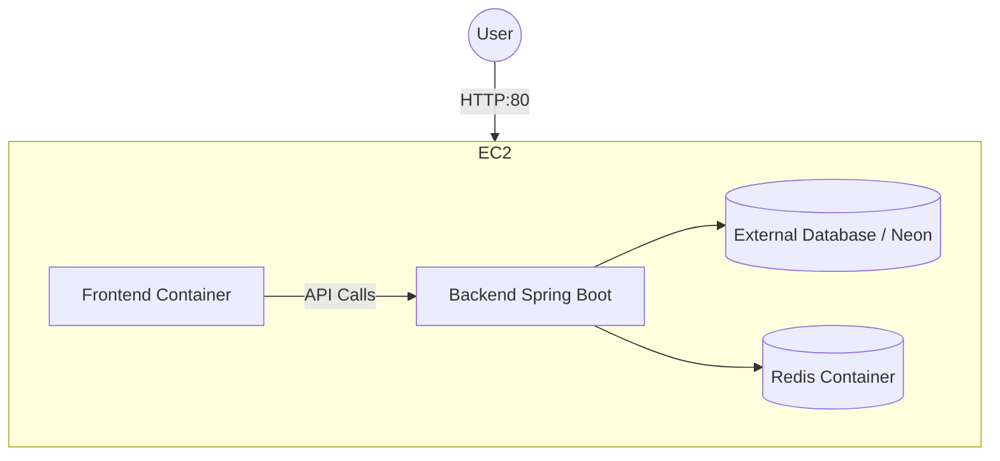

# AWS Deployment Guide for QuickFix/IrisPay

## 1. Architecture Overview
We will use **AWS EC2 (Elastic Compute Cloud)** to host both the Frontend and Backend using **Docker Compose**. This is the simplest and most cost-effective way to replicate your working local environment in the cloud.



## 2. Required Resources
- **AWS Account**
- **EC2 Instance**: `t3.small` (Recommended for Java apps) or `t2.micro` (Free tier, might be tight for memory).
- **Ubuntu Server 22.04 LTS** (Operating System).
- **Security Group**: Firewall rules allowing Port 22 (SSH), 80 (HTTP), and optionally 8080.

## 3. Step-by-Step Deployment

### Step 1: Launch EC2 Instance
1.  Log in to the **AWS Console**.
2.  Navigate to **EC2** > **Instances** > **Launch Instances**.
3.  **Name**: `IrisPay-Server`.
4.  **OS Image**: Select **Ubuntu** (Server 22.04 LTS).
5.  **Instance Type**: Select `t3.small` (2 vCPU, 2GB RAM). *Note: `t2.micro` (1GB RAM) might cause the Spring Boot backend to crash due to OutOfMemory errors.*
6.  **Key Pair**: Create new key pair (e.g., `iris-key.pem`). **Download and save this safely!**
7.  **Network Settings**: Create a security group allowing:
    -   SSH (Port 22) from My IP.
    -   Custom TCP (Port 80) from Anywhere (0.0.0.0/0).
    -   Custom TCP (Port 8080) from Anywhere (0.0.0.0/0) (Optional, for direct backend access).
8.  Click **Launch Instance**.

### Step 2: Connect to your Instance
Open your terminal (or Putty on Windows if not using PowerShell) and go to where you saved the key.

```powershell
# Restrict key permissions (Mac/Linux only, for Windows skip this or look up chmod equivalent)
# chmod 400 iris-key.pem

# Connect via SSH (replace x.x.x.x with your EC2 Public IP)
ssh -i "path/to/iris-key.pem" ubuntu@x.x.x.x
```
*Type `yes` if asked about fingerprints.*

### Step 3: Install Docker & Docker Compose
Run these commands inside the EC2 terminal:

```bash
# Update package list
sudo apt update

# Install Docker
sudo apt install docker.io -y

# Install Docker Compose Plugin
sudo apt install docker-compose-plugin -y

# Start Docker and enable it on boot
sudo systemctl start docker
sudo systemctl enable docker

# Add your user to the docker group (avoids using sudo for docker commands)
sudo usermod -aG docker $USER
```
*Note: You may need to logout (`exit`) and log back in (`ssh ...`) for the group change to take effect.*

### Step 4: Clone Your Project
You can clone directly from GitHub.

```bash
# Install Git
sudo apt install git -y

# Clone repo (Replace with your actual repo URL)
git clone https://github.com/Rudra9905/Project-1_QuickFix.git

# Enter project directory
cd Project-1_QuickFix
```

### Step 5: Configure Environment Variables
You need to set up the `.env` files for production.

**Backend Configuration:**
1.  Go to Backend: `cd Backend`
2.  Create/Edit .env: `nano .env`
3.  Paste your production configuration. **Important Update for Docker:**
    ```ini
    # Database (Use your Neon/External URL)
    DATABASE_URL=jdbc:postgresql://your-neon-db-url...
    
    # Redis (Should match the service name in docker-compose.yml)
    SPRING_DATA_REDIS_HOST=redis
    SPRING_DATA_REDIS_PORT=6379
    ```
4.  Save and exit (`Ctrl+O`, `Enter`, `Ctrl+X`).

**Frontend Configuration:**
1.  Go to Frontend: `cd ../Frontend`
2.  Create .env: `nano .env`
3.  Set the API URL to your EC2 Public IP or Domain:
    ```ini
    VITE_API_BASE=http://<YOUR_EC2_PUBLIC_IP>:8080
    ```
    *(Or if using Nginx reverse proxy, just `/api` or `http://<IP>/api`)*.

### Step 6: Update docker-compose for Production
We want the Frontend to run on Port 80, not 3000.

1.  Go back to root: `cd ..`
2.  Edit docker-compose: `nano docker-compose.yml`
3.  Change the Frontend ports section:
    ```yaml
    frontend:
      # ...
      ports:
        - "80:80"  # Change from "3000:80" to "80:80"
    ```
4.  Save and exit.

### Step 7: Build and Run
```bash
docker compose up --build -d
```
- `--build`: Rebuilds images.
- `-d`: Detached mode (runs in background).

### Step 8: Verify
Open your browser and enter `http://<YOUR_EC2_PUBLIC_IP>`.
You should see your application running!

## Troubleshooting Common Issues

### 1. "Application crashes immediately"
Check logs:
```bash
docker compose logs backend
```
Usually caused by:
- Missing `.env` variables.
- Wrong Database URL.
- Out of Memory (if using t2.micro).

### 2. "Connecttion Refused"
- Check AWS Security Groups (Is Port 80 Open?).
- Check if Docker containers are running: `docker ps`.

### 3. Database Connection Failures
- Ensure your Neon DB allows connections from anywhere or whitelist the EC2 IP.
