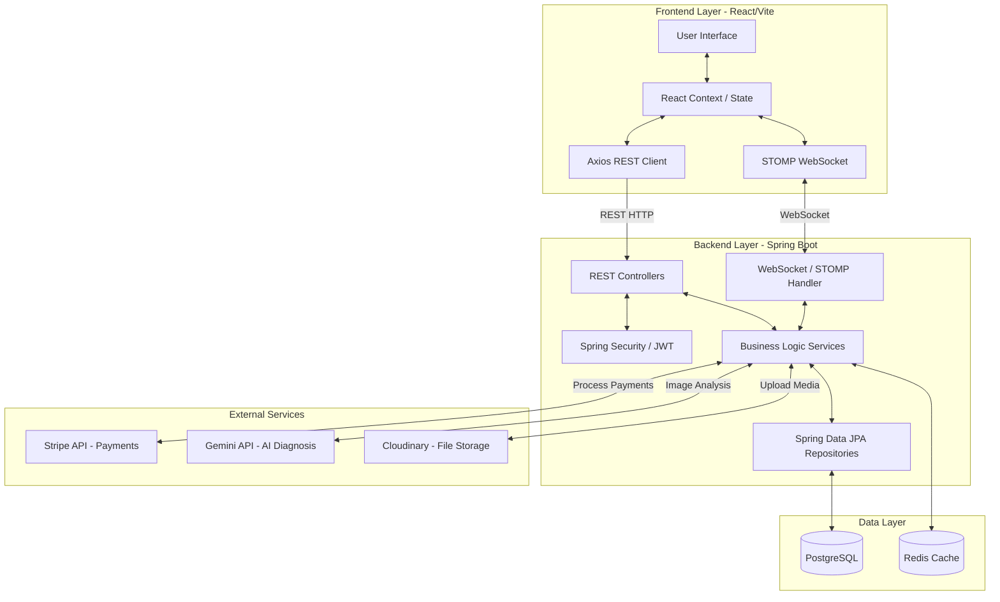
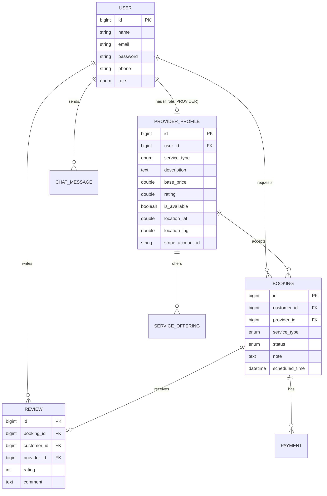
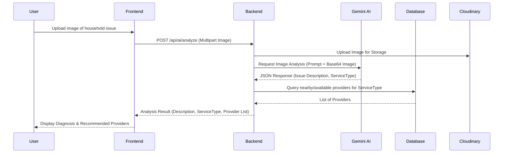
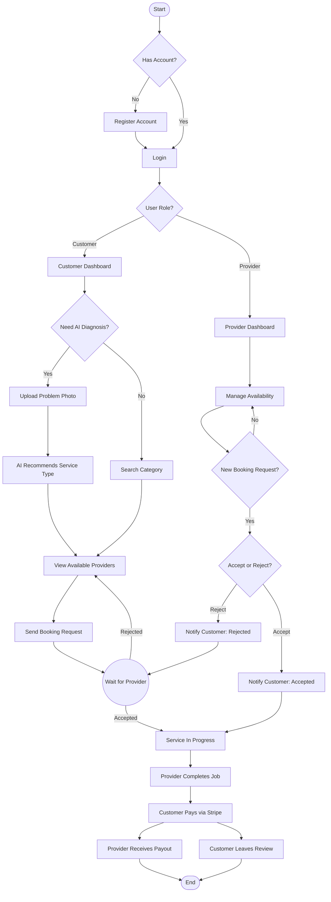

# Product Requirements Document (PRD): Quick Helper

## 1. Project Overview
Quick Helper is an on-demand service booking platform designed to connect customers with local service providers (e.g., plumbers, electricians, cleaners). It streamlines the process of finding, booking, and paying for household services. Additionally, it features an AI-driven issue diagnostic tool that allows users to upload photos of a problem and get automatic recommendations for the right service type and available providers.

## 2. User Personas

### 2.1 Customer (User)
- **Goal:** Quickly find reliable, available service providers to fix household issues.
- **Pain Points:** Unsure of what specific service is needed for a problem. Difficulty finding trusted providers quickly.
- **Key Actions:** Upload photos for AI diagnosis, search providers, book services, chat with providers, pay for services, leave reviews.

### 2.2 Service Provider
- **Goal:** Earn money by accepting service requests in their specialized domain.
- **Pain Points:** Finding consistent work, managing schedules, and securing payments safely.
- **Key Actions:** Create a profile, set availability/location, accept/reject booking requests, chat with customers, receive payouts.

### 2.3 Administrator
- **Goal:** Maintain platform quality, safety, and resolve disputes.
- **Key Actions:** Approve or reject provider profiles, monitor platform statistics.

---

## 3. Key Features

### 3.1 Authentication & Authorization
- Role-based Access Control (User, Provider, Admin).
- JWT-based authentication for secure session management.

### 3.2 AI-Powered Issue Diagnosis
- Integration with Gemini AI to analyze images uploaded by users.
- Automatically determines the issue description and corresponding `ServiceType` (e.g., PLUMBER, ELECTRICIAN).
- Recommends nearby available providers matching the service type.

### 3.3 Provider Discovery & Booking
- Location-based provider search.
- Booking flow: Request → Provider Accept/Reject → Completion.
- Real-time status updates.

### 3.4 Chat & Notifications
- Real-time messaging between Customers and Providers using WebSockets (STOMP).
- In-app notifications for booking state changes.

### 3.5 Payments
- Stripe integration for handling customer payments (PaymentIntents).
- Stripe Connect for onboarding providers and routing payouts securely.

### 3.6 Media & File Storage
- Cloudinary integration for handling profile pictures, resumes, demo videos, and problem images.

---

## 4. System Architecture

The application follows a standard modern web architecture with a decoupled React frontend and a Spring Boot backend, utilizing a PostgreSQL database and third-party APIs.

---

## 5. Database Schema (Entity-Relationship)

The following ER Diagram illustrates the core entities and their relationships within the PostgreSQL database.

---

## 6. AI Problem Diagnosis Workflow

This sequence diagram explains the flow of the AI diagnostic tool.

---

## 7. System Activity Diagram

This activity diagram illustrates the core user journeys for both Customers and Service Providers, from registration to service completion and payment.

---

## 8. Non-Functional Requirements (NFRs)
- **Scalability:** The backend uses stateless JWT authentication, making it easy to scale horizontally. Redis caching is used to optimize repetitive read queries.
- **Reliability:** The system falls back to mock generic responses if the Gemini API fails, ensuring the user experience is not completely blocked.
- **Performance:** Designed with pagination for large lists (providers, bookings, chat histories).
- **Security:** Passwords are encrypted using BCrypt. Secure HTTP-only integrations with Stripe are implemented for sensitive financial transactions.
- **Real-time Capabilities:** WebSockets enable immediate notifications and chat updates without need for long-polling.

---
*Generated for Quick Helper Project*
